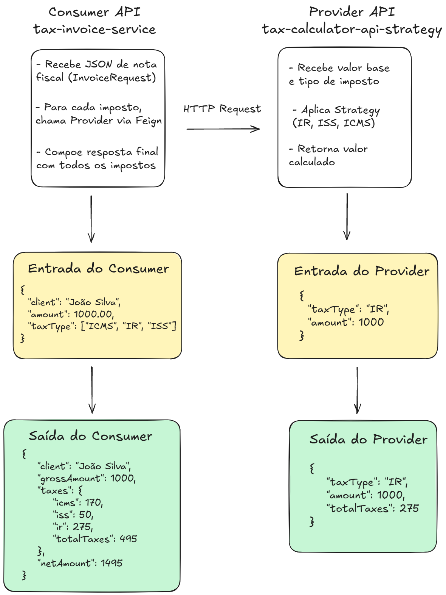

# 🧾 Invoice & Tax Microservices

Este repositório contém dois microserviços desenvolvidos em **Java com Spring Boot**, aplicando **arquitetura hexagonal** para garantir baixo acoplamento e alta coesão entre as camadas.

O foco principal foi exercitar boas práticas de design como **Strategy**, **Factory**, e a **comunicação entre serviços** via HTTP (Consumer ↔ Provider).

---

## ⚙️ Microserviços incluídos

### 📄 invoice-service

Responsável por processar faturas, consumindo o serviço de cálculo de impostos (`calculator-service`). Atua como **Consumer** e aplica regras de negócio sobre os impostos retornados, gerando:

- Total de tributos por tipo (ICMS, ISS, IR)
- Valor líquido
- Resumo por cliente

---

### 🧮 calculator-service

Simula uma API de cálculo de tributos, reutilizada de um projeto anterior. Seu core foi reestruturado com foco em:

- **Padrão Strategy**: cada imposto implementa uma estratégia de cálculo distinta.
- **Factory Pattern**: instanciador das estratégias de forma desacoplada.
- **Mock de dados**: não depende de banco.

---

## 🧠 Objetivos

- Aplicar **arquitetura hexagonal** com clareza entre domínio, casos de uso e portas.
- Praticar comunicação entre microserviços (Consumer x Provider).
- Demonstrar o uso prático de **Strategy** e **Factory** no contexto de negócios reais.
- Organizar os serviços em um **monorepo** limpo e reutilizável.

---

## 🗺️ Visão Geral da Arquitetura

A imagem abaixo representa de forma conceitual como os dois microsserviços se comunicam entre si:

<p align="center">
  
</p>

---

## 🧱 Arquitetura Hexagonal

Cada microserviço segue o mesmo princípio estrutural:

- **`domain`**: entidades e regras de negócio puras
- **`application`**: casos de uso e orquestração
- **`infra`**: adapters, controladores e integrações externas

Essa organização facilita testes, manutenção e evolução dos serviços de forma independente.

---

## 📂 Estrutura do Repositório

```plaintext
invoice-tax-microservices/
├── calculator-service/
│   └── src/...
├── invoice-service/
│   └── src/...
└── README.md
```

---

## Endpoints Disponíveis

### 📌 Processar faturas
**`POST /invoices`**  
Processa faturas com base no tipo e no valor fornecido.

> ⚠️ O provider roda na porta 8080.
> 
> ⚠️ O consumer roda na porta 8081.
> 
> ⚠️ Os endpoints do provider, caso queira testar, estão documentados no README do provider (`calculator-service`).


📥 **Requisição (JSON)**
```json
{
  "client": "João Silva",
  "amount": 1000.00,
  "taxType": ["ICMS", "IR", "ISS"]
}
```
📥 **Resposta (JSON)**
```json
{
  "client": "João Silva",
  "grossAmount": 1000,
  "taxes": {
    "icms": 170,
    "iss": 50,
    "ir": 275,
    "totalTaxes": 495
  },
  "netAmount": 1495
}
```

---

## 🐳 Como Rodar com Docker

Este projeto utiliza um **Dockerfile multi-stage**, separando as etapas de build e runtime para gerar
uma imagem leve e eficiente.

### Clonar o repositório:
```bash
git clone https://github.com/sirkaue/invoice-tax-microservices.git
cd invoice-tax-microservices
```


### 📦 Build da Imagem

Execute o comando abaixo na raiz do projeto (onde está o `Dockerfile` e o `docker-compose.yml`):

```bash
docker-compose up --build
```